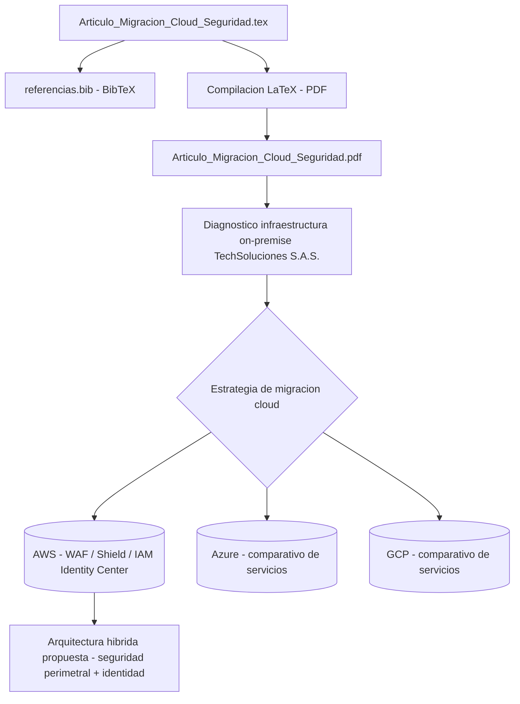

<div align="center">

# Migración Cloud desde la Seguridad

> **Análisis de servicios en la nube para una empresa de tecnología colombiana**


</div>

---

---

## Sobre el artículo

Artículo académico desarrollado para la asignatura **Fundamentos de la Tecnología Cloud — Unidad 3** del programa de **Maestría en Arquitectura de Software** del Politécnico Grancolombiano.

El artículo analiza la estrategia de migración hacia servicios en la nube de **TechSoluciones S.A.S.**, empresa colombiana ficticia de desarrollo de software con ~120 empleados. Se parte de un diagnóstico de su infraestructura *on-premise* actual, se proponen tres servicios cloud con énfasis en **seguridad y disponibilidad**, y se realiza un comparativo con equivalentes en Azure y GCP.

**Conclusión principal:** Una arquitectura híbrida basada en AWS —con capas de seguridad perimetral (WAF/Shield) e identidad (IAM Identity Center)— representa la opción más sólida para empresas medianas del sector TIC en Colombia.

---

## Arquitectura



## Contenido del artículo

| Sección | Descripción |
|---------|-------------|
| **1. Introducción** | Contexto de transformación digital en Colombia y amenazas ransomware (*WannaCry*) como catalizadores de la migración cloud |
| **2. Empresa y tecnologías actuales** | Diagnóstico de TechSoluciones S.A.S.: servidores físicos, VMware vSphere, AD local, VPN dedicada y sus vulnerabilidades |
| **3. Servicios cloud propuestos** | Tres servicios AWS seleccionados con justificación técnica y de seguridad |
| **4. Comparativo multi-cloud** | Tabla comparativa AWS vs Azure vs GCP en 11 dimensiones clave |
| **5. Seguridad ante amenazas actuales** | Mitigación estructural de ransomware mediante VPC privada, WAF y backups inmutables |
| **6. Conclusiones** | Estrategia multi-cloud progresiva AWS → GCP para cargas analíticas |

---

## Servicios cloud propuestos

### Amazon RDS for PostgreSQL
Base de datos gestionada con Multi-AZ, failover automático en <120s, cifrado en reposo (KMS) y en tránsito (TLS), backups automáticos de hasta 35 días en S3 cifrado, e integración con IAM para control de acceso granular. Elimina el riesgo de pérdida de datos por ransomware al desacoplar los backups de la red de producción.

### AWS WAF + AWS Shield Standard
Firewall de aplicaciones web gestionado que filtra solicitudes HTTP/HTTPS maliciosas (OWASP Top 10, SQLi, XSS, bots) antes de que alcancen las aplicaciones. Shield Standard provee protección DDoS sin costo adicional. Integración nativa con CloudFront para reducir latencia desde Colombia (nodos en Bogotá y São Paulo).

### AWS IAM Identity Center
Gestión centralizada de identidades (SSO) para consolas AWS, aplicaciones SaaS (Salesforce, Jira, GitHub) y herramientas internas. MFA obligatoria (TOTP/FIDO2), principio de mínimo privilegio, auditoría completa vía CloudTrail y eliminación de credenciales de larga duración.

---

## Comparativo de proveedores

| Dimensión | AWS (propuesto) | Microsoft Azure | Google Cloud |
|-----------|-----------------|-----------------|--------------|
| BD relacional | Amazon RDS for PostgreSQL | Azure Database for PostgreSQL | Cloud SQL for PostgreSQL |
| Alta disponibilidad | Multi-AZ, failover <120s | Zona redundante | Alta disp. regional |
| Backup automático | 1–35 días, S3 cifrado | 1–35 días, Azure Backup | 1–7 días (básico) |
| Firewall web | AWS WAF + Shield Std. | Azure Front Door + WAF | Cloud Armor |
| Protección DDoS | Shield Standard (gratuito) | DDoS Protection Básico | Cloud Armor Standard |
| Gestión de identidades | IAM Identity Center | Microsoft Entra ID | Cloud Identity |
| MFA nativa | TOTP, FIDO2 | Microsoft Authenticator | TOTP, llaves de seguridad |
| Presencia en Colombia | Baja latencia (us-east-1 / São Paulo) | Latencia moderada (Brasil) | Nodos en Bogotá |
| Madurez del ecosistema | Líder (+200 servicios) | Sólido para entornos MS | Excelente en datos/ML |

---

## Compilar el artículo

El artículo usa **LaTeX** con `biblatex` y `biber` para la bibliografía en formato APA 7ma edición.

### Requisitos

- [MiKTeX](https://miktex.org/) o TeX Live
- Biber (incluido en MiKTeX)
- LaTeX Workshop (extensión VS Code) — recomendado para preview lateral

### Compilación manual (terminal)

```bash
# Paso 1 — Primera compilación
pdflatex Articulo_Migracion_Cloud_Seguridad.tex

# Paso 2 — Procesar bibliografía
biber Articulo_Migracion_Cloud_Seguridad

# Paso 3 — Segunda compilación (referencias cruzadas)
pdflatex Articulo_Migracion_Cloud_Seguridad.tex

# Paso 4 — Tercera compilación (estabilizar referencias)
pdflatex Articulo_Migracion_Cloud_Seguridad.tex
```

### Compilación automática con latexmk

```bash
latexmk -pdf -bibtex Articulo_Migracion_Cloud_Seguridad.tex
```

### VS Code con LaTeX Workshop

1. Abrir `Articulo_Migracion_Cloud_Seguridad.tex` en VS Code
2. `Ctrl+Alt+B` — compilar
3. `Ctrl+Alt+V` — abrir preview PDF en panel lateral

---

## Estructura del repositorio

```
.
├── Articulo_Migracion_Cloud_Seguridad.tex   # Fuente LaTeX del artículo
├── Articulo_Migracion_Cloud_Seguridad.pdf   # PDF compilado
├── referencias.bib                           # Base bibliográfica (BibTeX/Biber)
└── README.md                                 # Este archivo
```

---

## Marco teórico y referencias clave

- **NIST SP 800-145** — *The NIST Definition of Cloud Computing* (2011)
- **AWS Documentation** — RDS, WAF, IAM Identity Center (2024)
- **MinTIC** — *Índice de Adopción Digital Empresarial en Colombia* (2023)
- **IDC Latin America** — *Cloud Market Share and Trends in Latin America* (2023)

---

## Autor

**Alejandro De Mendoza**
Estudiante — Maestría en Arquitectura de Software
Politécnico Grancolombiano · Fundamentos de la Tecnología Cloud

---

## Autor

**Alejandro De Mendoza**  
Ingeniero Informático · Especialista en IA · Especialista en Ingeniería de Software · Máster en Arquitectura de Software

[](https://github.com/AlejoTechEngineer)
